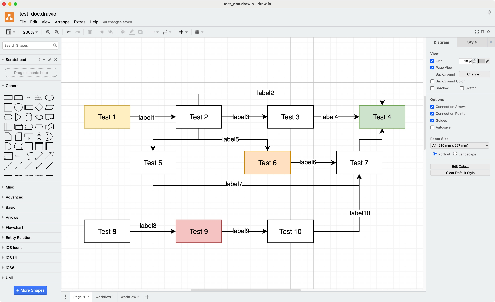
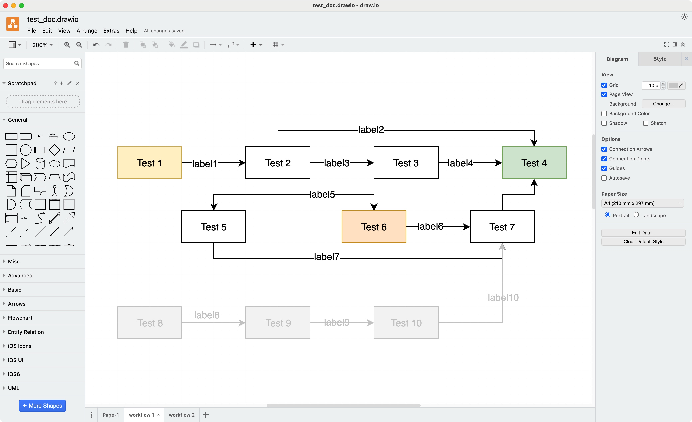
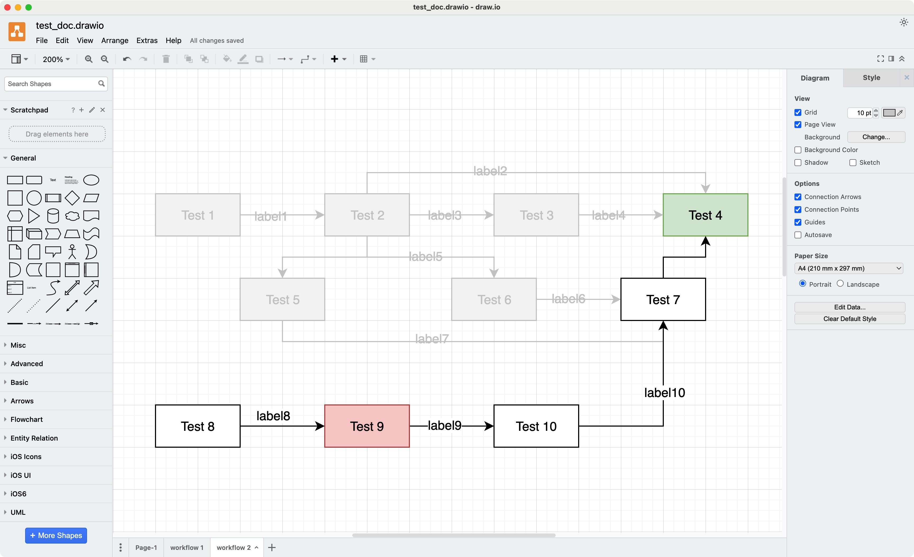

# Drawio-Sub-Workflow-Highlighter

A sub-workflow highlighter script for drawio.

## Background

Sometimes, we may need to create an extremely complicated diagram using drawio. 
In such cases, it can be a challenge to explain the diagram effectively 
and for the listener to understand it.

A good solution in these situations is to explain the diagram part by part. 
This approach helps break down the complexity and make it easier 
for both you and the listener to comprehend.

That is why I developed this small tool. 
It can help you highlight the different parts of the diagram 
using a workflows configuration file. 
This will make managing and explaining such a complex diagram easier.

Let me illustrate an example.


## Example

Suppose we have a complex diagram like this:



To facilitate explanation, we can separate it into two workflows. 
So we can build a JSON config file like the following:

```json
{
  "workflow 1": [
    "Test 1",
    "Test 2",
    "Test 3",
    "Test 4",
    "Test 5",
    "Test 6",
    "Test 7"
  ],
  "workflow 2": [
    "Test 8",
    "Test 9",
    "Test 10",
    "Test 7",
    "Test 4",
    "Test 13"  // Test 11 and Test 12 have been included by Test 13, 
               // only config a Test 13 here is enough. The script will 
               // help to involve Test 11 and Test 12 automatically
  ]
}
```

NOTE: The configuration file should have the same filename as the .drawio file. 
Additionally, they should both be located in the same folder, as shown below:

```
folder_name
 |
 +-- wf_highlighter.py
 |
 +-- test_doc.drawio
 |
 +-- test_doc.json
```

Then, run the python script in the terminal as this:

```
python3 wf_highlighter.py test_doc
```

We can finally receive some highlighted workflow pictures 
in the sub-tab of this drawio file like this:





## Note Points

1. The names of the nodes in the diagram should be different. 
If two different nodes have the same name, 
please use node(1) and node(2) to distinguish them.
